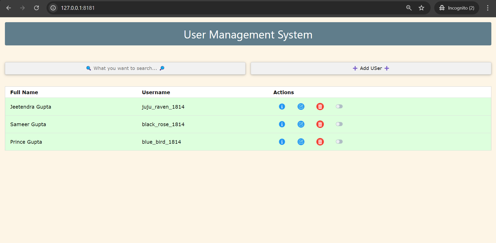

# Flask User Management API

Welcome to the **Flask User Management API**! This project provides a RESTful API for managing users, built with Python, Flask, and MongoDB. It allows you to create, retrieve, update, and delete users seamlessly.

## Table of Contents
- [Features](#features)
- [Frontend Integration](#frontend-integration)
- [Prerequisites](#prerequisites)
- [Project Setup](#project-setup)
- [API Endpoints](#api-endpoints)
- [MongoDB Indexing](#mongodb-indexing)
- [Error Handling](#error-handling)

---

## Features

- **User Management**:
  - Create, retrieve, update, and delete users.
  - Validation for unique usernames, emails, and mobile numbers.

- **Data Storage**:
  - Uses MongoDB for persistent storage with unique constraints.

- **Frontend**:
  - Simple web interface built with HTML and JavaScript for user interaction.

---

## Frontend Integration

The project includes a basic frontend that leverages the Fetch API to communicate with the Flask REST API. Key features include:

- **User Interface**: Forms for user creation and modification.
- **Dynamic Interaction**: Asynchronous requests to the backend update the user list in real time.

### Example Usage

Users can fill out forms to create new users or edit existing ones. The data is sent to the API, which responds with results, updating the display accordingly.

---

## Prerequisites

To get started, make sure you have the following:

- Python 3.7 or higher
- MongoDB (local or cloud instance)
- Optional: Virtual environment for Python (recommended)

---

## Project Setup

Follow these steps to set up the project:

1. **Clone the Repository**:
   ```bash
   git clone https://github.com/jeetendra29gupta/user-management-api.git
   cd user-management-api
   ```

2. **Set Up a Virtual Environment (Optional)**:
   ```bash
   python3 -m venv venv
   source venv/bin/activate  # On Windows, use `venv\Scripts\activate`
   ```

3. **Install Dependencies**:
   ```bash
   pip install -r requirements.txt
   ```

4. **Configure MongoDB**:
   Ensure MongoDB is running. The default configuration uses a local instance at `mongodb://localhost:27017/`. Modify the `MONGO_URI` in `app.config` if needed.

5. **Run the Application**:
   ```bash
   python main_app.py
   ```
   The API will be accessible at [http://localhost:8181](http://localhost:8181).

---

## API Endpoints

### 1. Home Route
- **URL**: `/`
- **Method**: `GET`
- **Description**: Serves the home page.


### 2. Create a New User
- **URL**: `/user`
- **Method**: `POST`
- **Request**:
  ```json
  {
    "first_name": "Jeetendra",
    "last_name": "Gupta",
    "username": "juju_raven_1814",
    "email": "jeetendra.gupta@example.com",
    "mobile_number": "1234567890"
  }
  ```
- **Response Codes**:
  - **201**: User created successfully.
  - **400**: Missing required fields or conflict.


### 3. Get All Users
- **URL**: `/users`
- **Method**: `GET`
- **Response Codes**:
  - **200**: List of users.
  - **500**: Server error.



### 4. Get User by ID
- **URL**: `/user/<user_id>`
- **Method**: `GET`
- **Response Codes**:
  - **200**: User found.
  - **404**: User not found.


### 5. Update User
- **URL**: `/user/<user_id>`
- **Method**: `PUT`
- **Request**:
  ```json
  {
  "first_name": "Jeetendra",
    "last_name": "Gupta",
    "username": "juju_raven_1814",
    "email": "jeetendra.gupta@gmail.com.com",
    "mobile_number": "9876543210"
  }
  ```
- **Response Codes**:
  - **200**: User updated successfully.
  - **404**: User not found.


### 6. Partially Update User
- **URL**: `/user/<user_id>`
- **Method**: `PATCH`
- **Request**:
  ```json
  {
    "is_active": false
  }
  ```
- **Response Codes**:
  - **200**: User updated successfully.
  - **404**: User not found.


### 7. Delete User
- **URL**: `/user/<user_id>`
- **Method**: `DELETE`
- **Response Codes**:
  - **200**: User deleted successfully.
  - **404**: User not found.


---

## MongoDB Indexing

To ensure uniqueness, the following indexes are created:
- `username`: Unique index
- `email`: Unique index
- `phone_number`: Unique index

These indexes are established when the app starts using the `@before_first_request` hook.

---

## Error Handling

- **400**: Bad request (e.g., missing fields).
- **404**: User not found.
- **500**: Server error.

---